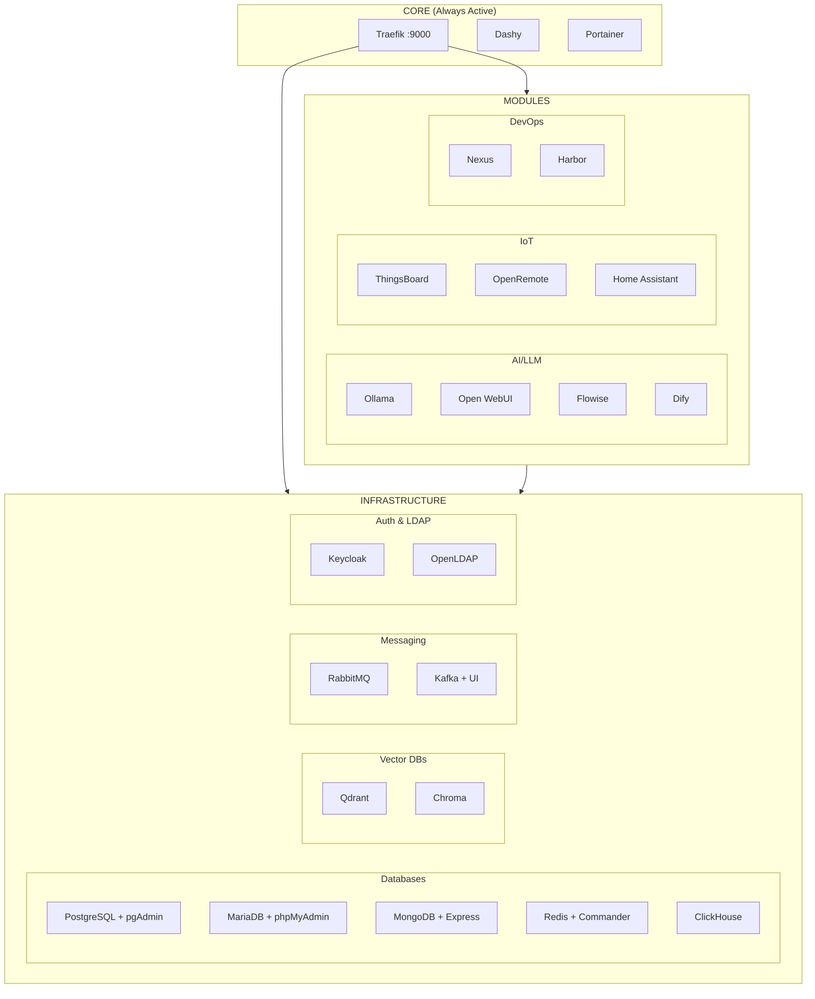

# Docker Infrastructure

Modular development infrastructure with Docker Compose. Start only what you need.

## Quick Start

```bash
# Install dependencies with uv
uv sync

# Run with uv
uv run python deploy.py core up

# Start core (Traefik, Dashy, Portainer)
uv run python deploy.py core up

# Add services
uv run python deploy.py add n8n postgres grafana

# View status
uv run python deploy.py status

# List running services
uv run python deploy.py running
```

## Architecture



## Commands

| Command | Description |
|---------|-------------|
| `core up/down/restart` | Manage core services |
| `up <services>` | Start services (replaces existing) |
| `add <services>` | Add services to existing |
| `down <services>` | Stop specific services |
| `down --all` | Stop all services |
| `restart [services]` | Restart services |
| `status` | Show current status |
| `running` | List running services only (this environment) |
| `list` | List all available services |
| `info <service>` | Show service details |
| `profile <name>` | Use a predefined profile |
| `logs [service]` | View logs |
| `clean` | Clean all resources |

## Configuration

### Dashboard Configuration (`config/dashboard.yaml`)

Choose which dashboards to use and configure theme:

```yaml
enabled_dashboards:
  - dashy       # Main dashboard
  # - homepage  # Alternative (gethomepage.dev)
  # - heimdall  # Another alternative

theme: glass    # Dashy theme (glass, nord, material, dark)
title: Dev Infrastructure
```

### External Links (`config/external-links.yaml`)

Add external services to your dashboard:

```yaml
links:
  - name: GitHub
    url: https://github.com
    icon: fab fa-github
    tags: [git, code]

  - name: Digital Ocean
    url: https://cloud.digitalocean.com
    icon: fas fa-cloud
    tags: [cloud]

  - name: Gmail
    url: https://mail.google.com
    icon: fas fa-envelope
    tags: [email]
```

### Credentials (`config/credentials.env`)

```env
ADMIN_USER=admin
ADMIN_PASSWORD=admin123
ADMIN_EMAIL=admin@localhost
```

### Service Config (`config/services.env`)

```env
POSTGRES_VERSION=16
OLLAMA_MODEL=llama3.2:1b
ODOO_DB=odoo
N8N_DB=n8n
```

### Dependencies (`config/dependencies.yaml`)

```yaml
n8n:
  - postgres
  - redis

grafana:
  - prometheus
```

## Directory Structure

```
docker-infra/
├── deploy.py                 # Main CLI
├── pyproject.toml           # uv/pip dependencies
│
├── config/
│   ├── credentials.env      # Global credentials
│   ├── services.env         # Service config
│   ├── dashboard.yaml       # Dashboard settings
│   ├── external-links.yaml  # External service links
│   └── dependencies.yaml    # Service dependencies
│
├── profiles/                # Predefined service groups
│   ├── data.yaml
│   ├── monitoring.yaml
│   └── ai.yaml
│
├── core/                    # Always active
│   ├── traefik/
│   ├── dashy/
│   └── portainer/
│
├── infra/                   # Base infrastructure
│   ├── databases/           # PostgreSQL, MariaDB, MongoDB, Redis, ClickHouse, Trino
│   ├── vectordb/           # Qdrant, Chroma
│   ├── messaging/          # RabbitMQ, Kafka
│   ├── storage/            # MinIO
│   └── dns/                # Technitium
│
├── modules/                 # Modular services
│   ├── ai/                 # Ollama, Flowise, Dify, AnythingLLM, Langfuse
│   ├── auth/               # Keycloak, OpenLDAP
│   ├── automation/         # n8n, Node-RED, StackStorm
│   ├── corporativo/        # Odoo, OpenProject, Dolibarr
│   ├── crm/                # SuiteCRM
│   ├── dashboard/          # Homepage, Heimdall
│   ├── data/               # Superset, Airflow, Dagster, Prefect, Windmill
│   ├── developer/          # Code-server, Backstage, Hoppscotch, Lighthouse
│   ├── devops/             # Nexus, Harbor
│   ├── documents/          # Paperless-ngx, Tandoor
│   ├── iot/                # ThingsBoard, OpenRemote, Kaa, Kura, Balena, Home Assistant
│   ├── lowcode/            # Budibase, AppSmith
│   ├── monitoring/         # Grafana, Prometheus, Loki, Uptime Kuma
│   ├── scheduling/         # Cal.com
│   ├── security/           # CrowdSec, AdGuard, OpenCTI, Vault, Vaultwarden
│   ├── social/             # Mastodon, Postiz, Mixpost
│   └── wiki/               # Outline, Wiki.js
│
├── .temp/                   # Generated docker-compose
├── volumes/                 # Bind mount data
└── logs/                    # Application logs
```

## Available Services (100+)

| Category | Services |
|----------|----------|
| **Core** | Traefik, Dashy, Portainer |
| **Databases** | PostgreSQL, MariaDB, MongoDB, Redis, Neo4j, Elasticsearch, ClickHouse, Trino |
| **Vector DBs** | Qdrant, Chroma |
| **Messaging** | RabbitMQ, Kafka |
| **Storage** | MinIO |
| **DevOps** | Nexus, Harbor |
| **Auth** | Keycloak, OpenLDAP + phpLDAPadmin |
| **Security** | Fail2Ban, CrowdSec, AdGuard, OpenCTI, Vaultwarden, Vault |
| **Monitoring** | Grafana, Prometheus, Loki, Tempo, Uptime Kuma, Gatus, Netdata |
| **Automation** | n8n, Node-RED, StackStorm |
| **Low-code** | Budibase, Appsmith |
| **Data** | Dagster, Superset, NocoDB, Prefect, Airflow, Windmill |
| **AI** | Ollama, Open WebUI, Flowise, Langfuse, Dify, AnythingLLM |
| **Corporate** | Odoo, OpenProject, Dolibarr, SuiteCRM, Mautic |
| **Social** | Mastodon, Mixpost, Postiz |
| **IoT** | ThingsBoard, OpenRemote, Kaa, Eclipse Kura, Balena, Home Assistant, Frigate |
| **Developer** | Code-server, Backstage, Hoppscotch, Lighthouse CI |
| **Documents** | Paperless-ngx, Tandoor Recipes |
| **Wiki** | Outline, Wiki.js |
| **Dashboard** | Homepage, Heimdall |
| **Scheduling** | Cal.com |
| **Email** | Mailu |
| **Notifications** | ntfy |
| **Ops** | Restic, Rclone, Watchtower |

## Access URLs

All services accessible via Traefik at port 9000:

```
http://<service>.127.0.0.1.traefik.me:9000
```

### Core
- http://traefik.127.0.0.1.traefik.me:9000 - Traefik Dashboard
- http://dashy.127.0.0.1.traefik.me:9000 - Main Dashboard
- http://portainer.127.0.0.1.traefik.me:9000 - Container Management

### Popular Services
- http://n8n.127.0.0.1.traefik.me:9000 - n8n Automation
- http://grafana.127.0.0.1.traefik.me:9000 - Grafana
- http://chat.127.0.0.1.traefik.me:9000 - Open WebUI
- http://code.127.0.0.1.traefik.me:9000 - Code Server
- http://thingsboard.127.0.0.1.traefik.me:9000 - ThingsBoard IoT
- http://ldap.127.0.0.1.traefik.me:9000 - phpLDAPadmin

## Default Credentials

| Service | Username | Password |
|---------|----------|----------|
| Most services | admin | admin123 |
| PostgreSQL | admin | admin123 |
| LDAP Admin | cn=admin,dc=infra,dc=local | admin123 |
| Portainer | (create on first access) | |

Override in `config/credentials.env`

## Profiles

Create profiles in `profiles/` to quickly start service combinations:

```yaml
# profiles/ai.yaml
description: AI/LLM Stack
services:
  - ollama
  - open-webui
  - flowise
  - qdrant
  - langfuse
```

Use with: `python deploy.py profile ai`

## Create New Module

1. Create folder:
```bash
mkdir -p modules/my-category/my-service
```

2. Create `docker-compose.yml`:
```yaml
services:
  my-service:
    image: my-image:latest
    container_name: my-service-infra
    labels:
      - "traefik.enable=true"
      - "traefik.http.routers.myservice.rule=Host(`myservice.127.0.0.1.traefik.me`)"
      - "traefik.http.routers.myservice.entrypoints=web"
      - "traefik.http.services.myservice.loadbalancer.server.port=8080"
    networks:
      - infra-network

networks:
  infra-network:
    external: true
```

3. Create `dashy.fragment.json`:
```json
{
  "name": "My Service",
  "icon": "fas fa-server",
  "url": "http://myservice.127.0.0.1.traefik.me:9000",
  "category": "MY-CATEGORY",
  "tags": ["my-tag"]
}
```

## Troubleshooting

### Container already exists
```bash
docker rm -f <container_name>
# Or clean all
python deploy.py clean
```

### Service not accessible
```bash
# View logs
python deploy.py logs <service>

# Check Traefik
docker logs traefik-infra
```

### View generated docker-compose
```bash
cat .temp/docker-compose.yml
```

## Requirements

- Docker & Docker Compose v2
- Python 3.10+
- uv (recommended) or pip

## License

MIT - Use, modify and share freely.
